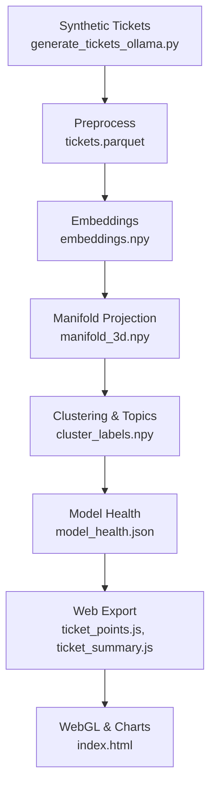

# **Qognus Demo Platform — Architecture**

*ApexGrid Systems Synthetic Enterprise & ML Visualization Stack*

---

## 1. Purpose

This document describes the **system architecture** of the Qognus Demo Platform, which provides a fully synthetic environment for experimenting with and demonstrating applied AI/ML techniques on the fictional hybrid enterprise **ApexGrid Systems**.

The architecture covers:

* synthetic data generation
* ML/embedding pipeline
* evaluation & metrics
* static web visualization
* optional agentic workflows

All components are designed to run on a single developer machine or small server, with no external data dependencies and no real customer information.

---

## 2. High-Level System Overview

At a high level, the system has four main layers:

1. **Synthetic Data Layer**

   * Uses local LLMs (Ollama) to generate ApexGrid support tickets and (optionally) other signals.
2. **ML & Analytics Layer**

   * Computes embeddings, projections, clusters, and model-health metrics.
3. **Artifact Layer**

   * Converts ML outputs into web-friendly JSON/JS payloads and charts.
4. **Visualization & Interaction Layer**

   * Renders a WebGL 3D embedding, charts, and dashboards in a browser.

### 2.1 High-Level Diagram (ASCII)

```text
           ┌──────────────────────────┐
           │   Synthetic Data Layer   │
           │  (LLMs via Ollama)       │
           └──────────┬───────────────┘
                      │   JSONL tickets
                      ▼
           ┌──────────────────────────┐
           │   ML & Analytics Layer   │
           │ embeddings, clustering,  │
           │ evaluation, metrics      │
           └──────────┬───────────────┘
                      │  JS/JSON artifacts
                      ▼
           ┌──────────────────────────┐
           │   Artifact Layer         │
           │ web-ready JS payloads    │
           └──────────┬───────────────┘
                      │  static files
                      ▼
           ┌──────────────────────────┐
           │   Visualization Layer    │
           │ WebGL + charts (browser) │
           └──────────────────────────┘
```

---

## 3. Context: ApexGrid & Qognus Demo Platform

The architecture is built around:

* **ApexGrid Systems**: a fictional hybrid enterprise with four products:

  * HelioCloud (SaaS observability)
  * GridSense (energy/utility IoT monitoring)
  * LineaOps (manufacturing & robotics)
  * VaultShield (identity & security analytics)

* **Qognus Demo Platform**: a set of synthetic data generators, ML pipelines, and visualizations that:

  * showcase applied AI workflows
  * demonstrate embeddings & clustering
  * remain fully local and safe for public use

---

## 4. Component Architecture

### 4.1 Synthetic Data Layer

**Primary Role:** Create realistic, taxonomy-aligned ApexGrid support tickets using local LLMs.

**Key Components:**

* `synthetic/generate_tickets_ollama.py`

  * Reads a metadata matrix (product, category, severity, etc.)
  * Builds structured prompts
  * Calls Ollama’s `/api/chat` endpoint
  * Receives JSON tickets and validates them

* `docs/data_generation_design.md`

  * Defines prompting strategy, constraints, and distributions

**Primary Output:**

* `data/raw/apexgrid_tickets.jsonl`

  * One JSON object per line
  * Matches the schema in `support_taxonomy.md`

### 4.2 ML & Analytics Layer

**Primary Role:** Transform raw tickets to embeddings, clusters, metrics, and visual insights.

**Sub-components:**

1. **Preprocessing & Normalization**

   * Script: `models/embed/compute_embeddings.py`
   * Tasks:

     * Load JSONL → DataFrame
     * Normalize schema
     * Create unified `text` field (summary + description)
     * Save `tickets.parquet` and metadata

2. **Embeddings**

   * Script (same as above, second part)
   * Calls Ollama’s `/api/embeddings`:

     * Model examples: `mxbai-embed-large`, `nomic-embed-text`
   * Produces:

     * `data/processed/embeddings.npy`

3. **Manifold Projection**

   * Script: `models/cluster/cluster_umap_hdbscan.py`
   * Techniques:

     * UMAP / t-SNE / PaCMAP to project to 3D
   * Produces:

     * `data/processed/manifold_3d.npy`

4. **Clustering & Topic Extraction**

   * Script: same as above
   * Algorithm:

     * HDBSCAN (primary)
   * Produces:

     * `data/processed/cluster_labels.npy`
     * `data/processed/cluster_summary.json`

5. **Model Health & Metrics**

   * Script: `models/eval/embedding_health.py`
   * Computes:

     * silhouette score
     * cluster size distribution
     * noise fraction
     * severity distribution
     * category/product purity
   * Produces:

     * `data/processed/model_health.json`

---

## 5. Data Flow

### 5.1 Logical Data Flow

```text
[1] Synthetic Generation
    - apexgrid_tickets.jsonl

        ↓

[2] Preprocessing
    - tickets.parquet
    - ticket_meta.json

        ↓

[3] Embeddings
    - embeddings.npy

        ↓

[4] Manifold Projection
    - manifold_3d.npy

        ↓

[5] Clustering & Topics
    - cluster_labels.npy
    - cluster_summary.json

        ↓

[6] Evaluation
    - model_health.json

        ↓

[7] Export for Web
    - web/data/ticket_points.js
    - web/data/ticket_summary.js
```

### 5.2 Mermaid Overview (optional)

You can paste this into a Mermaid-compatible renderer:



---

## 6. Visualization & Interaction Layer

**Primary Role:** Present the ML outputs in a visually compelling, interactive interface suitable for:

* client demos
* website sections
* POCs
* workshops

**Key Components:**

* `web/index.html`

  * Static HTML entrypoint
  * Loads:

    * Three.js
    * TailwindCSS
    * Chart.js
    * Vue.js (CDN)
    * `web/data/ticket_points.js`
    * `web/data/ticket_summary.js`

* `web/js/embedding_viz.js`

  * Creates a Three.js scene
  * Plots tickets as 3D points
  * Colors points by category, product, or severity
  * Adds interaction (hover info, rotation, zoom)

* `web/js/charts.js`

  * Uses Chart.js to render:

    * severity distributions
    * category counts
    * product mix
    * cluster metrics

* `web/js/tabs.js`

  * Simple tab or mode switching between:

    * 3D embedding
    * model health view
    * distributions
    * cluster insight panels

Deployment is as simple as serving `web/` via a static HTTP server.

---

## 7. Deployment & Runtime Environments

### 7.1 Local Development

Typical local stack:

* OS: Windows / macOS / Linux
* Python virtual environment
* Ollama running locally
* Static HTTP server for the `web` folder

Example commands:

```bash
# 1. Generate synthetic data
python synthetic/generate_tickets_ollama.py

# 2. Run embedding pipeline
python models/embed/compute_embeddings.py
python models/cluster/cluster_umap_hdbscan.py
python models/eval/embedding_health.py

# 3. Serve the web app
cd web
python -m http.server 3000
```

Then visit: `http://localhost:3000`.

### 7.2 Optional Containerization

For portability, components can be containerized:

* Container 1: Python ML stack + Ollama client
* Container 2: Ollama server with models
* Container 3: Static web server (nginx or similar)

This is not mandatory for demos but can support more advanced environments.

---

## 8. Security & Privacy Considerations

The architecture is intentionally designed so that:

* **All data is synthetic.**

  * No real customers, log lines, or metrics are used.
* **LLMs run locally via Ollama.**

  * No external calls are required.
* **No external API keys are needed** for core functionality.
* **No personal identifiers** should appear in generated text:

  * Enforced via prompting + validation.

This makes the system safe to use in:

* public talks
* recorded demos
* shared repositories
* client-facing materials (with clear “synthetic data” disclaimer)

---

## 9. Extensibility

The architecture is modular. Future extensions can sit naturally alongside existing layers.

### 9.1 Additional Data Modalities

* IoT telemetry time-series for GridSense / LineaOps
* synthetic identity access logs for VaultShield
* synthetic application traces and metrics for HelioCloud
* synthetic billing or usage data for financial modeling

These can feed:

* anomaly detection models
* forecasting services
* multi-modal embeddings

### 9.2 Agent & API Layer

A minimal API (e.g., FastAPI/Flask) can sit between ML artifacts and the UI:

* New ticket → embed → nearest neighbors → triage suggestion
* Cluster exploration → fetch representative tickets → LLM summary
* Incident detection → highlight clusters with recent spikes

This layer would:

```text
[Frontend] ⇄ [API: triage, search, incident] ⇄ [Embeddings + Metadata]
```

### 9.3 Integration with Other Tools

The artifacts can be used in:

* notebooks (exploration, teaching)
* slide decks (screenshots of 3D embeddings & charts)
* external dashboards (e.g., Grafana, Superset)
* other web experiences

---

## 10. Summary

The Qognus Demo Platform architecture:

* starts with **synthetic ApexGrid support tickets**, generated via local LLMs
* flows through an **ML pipeline** producing embeddings, projections, clusters, and metrics
* exports into **lightweight JS payloads**
* renders in a **static, portable WebGL + chart-based UI**

It is:

* self-contained
* composable
* reproducible
* safe for public and client-facing use

This architecture forms the backbone for many future POCs, demos, and applied AI experiments within the Qognus ecosystem.